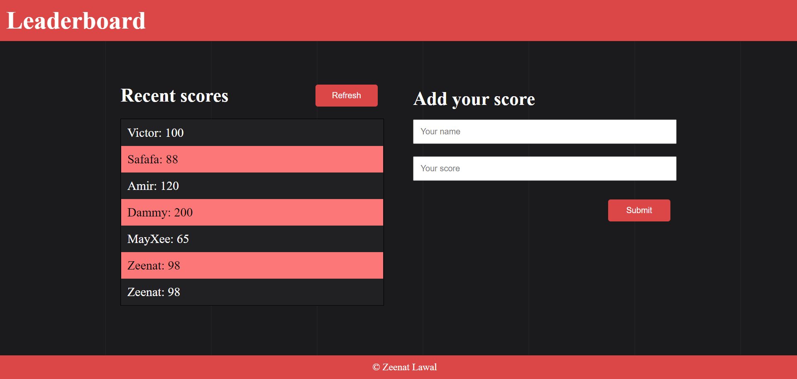

# Leaderboard
> The leaderboard website displays scores submitted by different players. It also allows you to submit your score. All data is preserved with the external Leaderboard API service.

## Built With

- HTML
- CSS
- JavaScript(ES6)
- Webpack

## Live demo

[Live demo link](https://zeenatlawal.github.io/Leaderboard/dist/)

## Getting Started

### To get a local copy run the following steps:

- Copy this link `https://github.com/ZeenatLawal/Leaderboard.git`
- Open your terminal or command line
- Run `git clone` and paste the link
- Open the folder with your code editor
- Create a branch to work on
- Run `npm install`
- Run `npm run build`
- Run `npm run start` to launch the server.

### To create your own game ID with this API (Using Postman App)

- Open your Postman App
- Enter this URL `https://us-central1-js-capstone-backend.cloudfunctions.net/api/games/`
- Change the action to POST
- Go to the Body tab, select raw and JSON as the format
- Paste this in the body field `{"name": "Your game name"}`
- Click send and you should get a result with the unique identifier e.g. `Zl4d7IVkemOTTVg2fUdz`
- Open the `index.js` file and replace the ID in the URL variable with your ID
- Save the file and launch the server, your recent scores list should be empty
## Author

👤 **Zeenat Lawal**

- GitHub: [@ZeenatLawal](https://github.com/ZeenatLawal)
- Twitter: [@lawal_zeenat](https://twitter.com/lawal_zeenat)
- LinkedIn: [Zeenat Lawal](https://www.linkedin.com/in/zeenatlawal/)

## 🤝 Contributing

Contributions, issues, and feature requests are welcome!

Feel free to check the [issues page](https://github.com/ZeenatLawal/Leaderboard/issues).

## Show your support

Give a ⭐️ if you like this project!

## Acknowledgments

- Learning partners, Standup and morning session team
